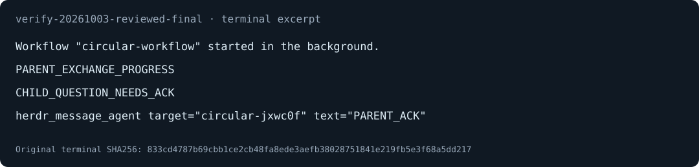

# 修复父子代理循环等待，保留后台 workflow 等待



图来自保存的 `verify-20261003-reviewed-final/terminal.json`，只裁出信号行并渲染成 SVG，不是完整屏幕截图。没有改写输出，也没有复制本机路径。图中没有子代理完成结果，完整的 ACK receipt、子代理实际消费 ACK 后完成及测试输出见[可分享证据摘录](assets/circular-wait-proof.txt)。SVG 与摘录可纳入版本控制，原始 artifact 则保持 gitignored。

## Summary

本次交付一项窄修复：前台 result 引擎等待遇到新输入时返回真实的 interim snapshot，让 pi 有机会处理子代理的问题。后台 workflow 继续等待子代理完成。当前模型可见的 `herdr_get_agent_result` 仍然 single-shot，schema **没有恢复 `wait`**。

快速审批可读「Evidence」「Merge Danger」「批准检查」。缺背景可先读下面的循环等待解释。

```text
修复前
  父代理 result wait 等子代理完成
  子代理等父代理 ACK 才完成
  pi 把问题放入 Steering，等父代理工具返回才交给模型
  因此两边都不能继续

修复后
  input 事件推进前台 wake epoch
  result wait 返回 interim + interruptedByInput
  pi 按原有队列语义把问题交给父代理模型
  父代理发 ACK，子代理消费 ACK 后完成
  workflow 的后台 wait 用 inputWake: null，仍等完成
```

### 消息已经送达，为什么父代理仍不回答？

`message_agent` 的 delivered receipt 证明消息送到 pane，不证明模型已读。父代理忙于工具时，pi 会把输入排到 Steering。模型必须等工具返回，才能看到该输入。

本次复现让子代理通过真实消息工具发送 `CHILD_QUESTION_NEEDS_ACK`，在模型上下文收到 `PARENT_ACK` 前一直工作。旧式 wait-forwarding 适配器让父代理调用内部 `getAgentResult({wait: true})`。父代理等子代理完成，子代理等父代理回复，而回复又等父代理的 result 工具完成。这才是循环等待。

消息丢失假设被排除，因为终端显示真实问题已在 Steering。子代理错误地被判定为 idle 的假设也被排除，因为后续真实状态为 working，工具循环仍在等待 ACK。把 steer 改成 followUp 无法释放 pending 工具，因此不改消息投递语义，也不 abort 其他工具。

### 选择 A，不引入第二套消息系统

采用修订版 A，即前台 input-event wake。它只观察「有输入」，不读取、保存或重写消息内容。`getAgentResult` 在整次调用开始时固定 epoch，检查期间或订阅前到达的输入也能触发返回。终态证据优先于输入中断，abort 在异步检查后再次确认。

排除 B，即另建 mailbox transport 或要求调用者显式 opt-in 的 wait mailbox。现有 pi input 事件已经提供唤醒时机，无需另一套队列和 receipt。仅在新工具 execute 注入 wake 的方案也不能覆盖保持 `getAgentResult(params, {signal})` 原样的旧式兼容调用。

两份 architect 草案中的「恢复模型 `wait`」「默认关闭 wake」「新增 `pendingMessages`」都没有进入实际代码。候选名称在草案中并不一致，这里以最终选择和实现为准。固定短 timeout 或提高轮询频率也不采用，它们改变正常长等待的语义，且不直接处理输入事件。

### 本次实际修改范围

- [src/inputwake.ts](../../src/inputwake.ts) 新增 epoch、广播订阅及 session 生命周期管理。timer、订阅和 abort listener 共用清理路径。
- [src/tools/result.ts](../../src/tools/result.ts) 注册前台 wake。内部等待默认读取已注册 scope，输入到达时返回 `interim: true` 和 `interruptedByInput: true`。注册工具仍只接受 `target` 和 `lines`。
- [src/workflow/host.ts](../../src/workflow/host.ts) 明确传入 `inputWake: null`，防止后台等待被前台输入打断。
- [package.json](../../package.json) 把 `tests/input-wake.mjs` 加入默认测试链。[tests/smoke.mjs](../../tests/smoke.mjs) 更新新增 lifecycle handler 的数量断言。
- 六个相关测试及 fixture：[input-wake.mjs](../../tests/input-wake.mjs)、[circular-wait-live.mjs](../../tests/circular-wait-live.mjs)、[turn-release-live.mjs](../../tests/turn-release-live.mjs)、[circular-exchange.ts](../../tests/fixtures/circular-exchange.ts)、[turn-probe-entry.ts](../../tests/fixtures/turn-probe-entry.ts)、[turn-probe.ts](../../tests/fixtures/turn-probe.ts)。turn-release 文件来自前一轮 stale-runtime 诊断，不应被描述为新增生产修复。
- [verify-pi-herdr skill](../../.pi/skills/verify-pi-herdr/SKILL.md) 及其 features、scripts 提供本地真实 CLI/TUI 验证、保留证据和 scoped cleanup。[.gitignore](../../.gitignore) 忽略项目 `.artifacts/verification/`。
- 两份本次记录：[circular-wait notes](../../.agents/notes/circular-wait-implementation-notes.md)、[orchestrator-responsive notes](../../.agents/notes/orchestrator-responsive-implementation-notes.md)，以及本交付文档、demo 和安全证据摘录。

## Evidence

### Before：收到问题，但循环不推进

[circular-wait notes 的原始失败记录](../../.agents/notes/circular-wait-implementation-notes.md) 保存了修复前默认 `node tests/circular-wait-live.mjs` 的真实 RED。关键输出也保存在[可分享摘录](assets/circular-wait-proof.txt)。

```text
RED parent consumed question and replied=false; elapsed=2509ms
AssertionError: parent must consume child question and send ACK within 2.5s while waiting for child
```

旧式适配器只恢复注册边界的 wait-forwarding。真实 Herdr CLI、pi TUI、当前 result 引擎及消息工具都在链路上。它不是已加载旧进程的内存复制。启动或 fixture 错误不计入这个 RED，也没有把 RED 提交成 git 历史。

### After：同一默认兼容入口推进完整 ACK 链

修复后的独立 review 日志 `/tmp/pi-herdr-circular-review-live.log` 记录：

```text
GREEN parent consumed question and replied=true; elapsed=566ms
GREEN full circular exchange progressed and child completed after ACK
GREEN parent consumes and answers ordinary user input
```

这是实际运行记录，不是本交付文档重跑的 live 测试。父代理断言要求消息工具 receipt 的 `delivered=true`，子代理必须在模型上下文收到 ACK 后才输出 `CHILD_COMPLETE_AFTER_ACK`。busy control 日志记录 1588ms，测试还断言独立 bash 工具正常输出 `UNRELATED_TOOL_FINISHED`，没有被 abort。notes 的 1440ms 是另一次运行，不与这份 review 日志混用。

### 保留证据证明一个真实后台 workflow exchange

项目保存的 [result.json](../../.artifacts/verification/verify-20261003-reviewed-final/result.json) 为 `feature=workflow`、`exitCode=0`，三个 GREEN 均通过。该次加载当前 checkout、snapshot-only 注册，不走旧式 wait 入口。因此它证明后台控制路径未退化，不能替代前面默认兼容入口的修复证明。输出中的 1ms 是问题被 harness 检出后的观察间隔，不是端到端消息延迟。

完整本地证据链如下，PR 读者没有 raw artifacts 时使用上面的可分享摘录：

- [doctor.json](../../.artifacts/verification/verify-20261003-reviewed-final/doctor.json) 记录 Herdr 0.9.3、pi 1.0.0、Node v24.19.0、checkout source 和 harness hash。
- [parent.jsonl](../../.artifacts/verification/verify-20261003-reviewed-final/parent.jsonl) 记录 workflow dispatch、成功 ACK receipt、汇总完成及普通用户回合。[children/1.jsonl](../../.artifacts/verification/verify-20261003-reviewed-final/children/1.jsonl) 记录实际用户 ACK 和随后的 assistant completion。
- [terminal.json](../../.artifacts/verification/verify-20261003-reviewed-final/terminal.json)、[input-events.jsonl](../../.artifacts/verification/verify-20261003-reviewed-final/input-events.jsonl)、[transport.jsonl](../../.artifacts/verification/verify-20261003-reviewed-final/transport.jsonl) 保留终端、输入和驱动命令输出。[evidence.json](../../.artifacts/verification/verify-20261003-reviewed-final/evidence.json) 记录 transcript hash。
- [cleanup.json](../../.artifacts/verification/verify-20261003-reviewed-final/cleanup.json) 确认自有 workspace 与 scratch 已移除、证据保留。[cleanup-safety.txt](../../.artifacts/verification/verify-20261003-reviewed-final/cleanup-safety.txt) 及 [repeated-cleanup.txt](../../.artifacts/verification/verify-20261003-reviewed-final/repeated-cleanup.txt) 记录拒绝越界和重复清理检查。
- [relocation-receipt.json](../../.artifacts/verification/verify-20261003-reviewed-final/relocation-receipt.json) 记录 18 个原文件逐项 SHA256 一致、parent hash 匹配及原目录已不存在。receipt 的旧路径是历史记录，不是当前操作目录；迁移没有重跑 Evidence 或 Cleanup。

### 单元和类型检查不等于全量 live coverage

本交付再次执行 `node tests/input-wake.mjs` 和 `npm run typecheck`，均 exit 0。单元覆盖 inspect 中输入、订阅竞争、广播、清理、abort、数值期限、默认兼容调用、后台 opt-out、session 更换及多实例隔离。

独立 review 发现同步 `subscribe()` 回调后会遗留 abort listener。加入监听数必须为 0 的断言后先失败，再修复清理路径并通过。当前测试保留该断言。

提交前再次清除继承的 `PI_HERDR_*` 子代理环境，仅对测试子进程生效；`npm test` 全链 exit 0，日志保存在 `/tmp/pi-herdr-pr-tests.log`。最后一套输出 `99 passed, 0 failed`，不是全项目总数。`node tests/input-wake.mjs`、`npm run typecheck` 与 cleanup guard 回归也再次通过。较早 orchestrator notes 的全链超时是当时的记录，不是当前代码仍无修复的结论。

确定性 provider 只替换模型决策。真实 CLI、TUI、子进程、消息、ACK 和 session 写入被执行，但不证明自主模型一定停止轮询、真实 provider 鉴权、manual dialogs、resume、视觉布局或所有 workflow 能力。最终 retained run 只走一个 workflow exchange，不宣称独立覆盖整个 feature map。

## Merge Danger

**Door: two-way。** 可回退代码与 fixture，没有数据迁移。回退同样需要新进程或安全 reload，不会替换已 pending 的 execute。

**Blast Radius: result-wait。** 影响内部前台 wait 的提前返回和 session scope。模型可见 snapshot 工具及消息投递协议保持不变，后台 host 显式 opt-out。

### 风险和 Deviations

- 一个已注册 scope 时，裸 `GetResultDeps` 默认前台 wake。没有注册 scope 时不凭空产生 wake。多个 pi session 共用同一已加载引擎时，默认 wait 明确抛错，必须传显式 scope 或 `null`，不静默选错 session。
- 输入到达只释放 result wait，不终止兄弟工具。独立工具若无限阻塞，pi 仍可能无法消费 Steering。这不在本次承诺内。
- input 被其他 extension 提前吞掉、输入频繁导致模型多轮重试等未被本次 fixture 穷尽。后台数值期限仍可能按旧 poll interval 超时返回，不宣称修复其精度。
- 已加载旧会话不会 hotpatch。等旧等待自然完成后安全 `/reload`，或使用新父进程。reload 会重置内存 registry，shutdown 也可能影响 workflow-owned children；先保留 handle 和 session 信息。没有中断、reload 或操作既有用户 pane。
- 早期 orchestrator notes 的「无产品修复」对应 stale-runtime 诊断；后续循环复现导致本次三个生产文件的修复。以当前代码和 artifact 为准，不把历史结论当最终交付。
- 用户后续授权提交与创建 PR。本次仅暂存上列白名单文件，在 `fix/circular-wait-input-wake` 分支交付，PR 目标为 main；无关 dirty 文件和原始证据不提交。未形成 failing-test-first git 历史，早期 notes 中禁止提交的说明保留为历史上下文。
- 本交付不部署、不合并，也不涉及 Tailscale 或 REMOTE 流程。

## 批准检查

- [ ] 接受「输入释放前台内部等待，后台等待保持完成语义」，不恢复模型 schema 的 `wait`。
- [ ] 接受多 session 默认 wait 的显式拒绝，以及无限阻塞独立工具不在承诺范围内。
- [ ] 确认 ACK 消费与完成的证据，而不只看 delivered 或截图。接受确定性 provider 的证明边界。
- [ ] 将上列本次文件纳入 PR，包含 SVG 和安全证据摘录；原始 `.artifacts/verification/` 不提交。
- [ ] 排除既有无关 `CONTEXT.md` 删除、`.claude` 与 `.codex` skill symlink、`CLAUDE.md`、`agents/`、release-1.0.0 notes 及其他发布改动。不要 `git add .`。
- [ ] 合并后从新进程验证，或在确认旧任务安全后 reload；不要把磁盘更新当作旧会话已经修复。

批准对象是这个有边界的 result-wait 修复及验证交付，不是全量 live coverage 或远程上线。
